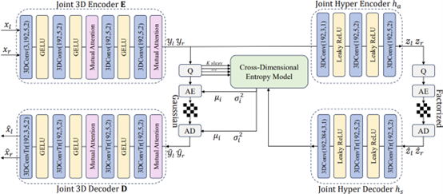
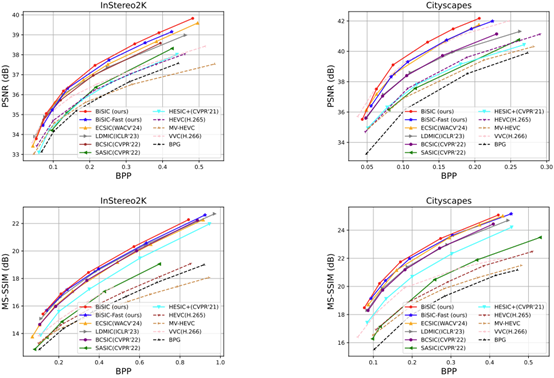
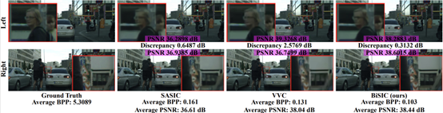

# [ECCV'24] BiSIC: Bidirectional Stereo Image Compression

This is the official PyTorch implementation of our **ECCV 2024** paper: 

**Bidirectional Stereo Image Compression with Cross-Dimensional Entropy Model**

[Zhening Liu](https://liuzhening.top), [Xinjie Zhang](https://xinjie-q.github.io/), [Jiawei Shao](https://shaojiawei07.github.io/), [Zehong Lin](https://zhlinup.github.io/), [Jun Zhang](https://eejzhang.people.ust.hk/)

[[ArXiv Preprint](https://arxiv.org/abs/2407.10632)]

## :star:Overview
With the rapid advancement of stereo vision technologies, stereo image compression has emerged as a crucial field that continues to draw significant attention. Previous approaches have primarily employed a unidirectional paradigm, where the compression of one view is dependent on the other, resulting in imbalanced compression. To address this issue, we introduce a symmetric bidirectional stereo image compression architecture, named BiSIC. Specifically, we propose a 3D convolution based codec backbone to capture local features and incorporate bidirectional attention blocks to exploit global features. Moreover, we
design a novel cross-dimensional entropy model that integrates various conditioning factors, including the spatial context, channel context, and stereo dependency, to effectively estimate the distribution of latent representations for entropy coding. Extensive experiments demonstrate that our proposed BiSIC outperforms conventional image/video compression standards, as well as state-of-the-art learning-based methods, in terms of both PSNR and MS-SSIM.
<p align="center">
  
</p>
<!--  -->

## :sparkles:Performance Illustration
We illustrate the R-D performances and qualitative visualization of our method. For more details, please check the official paper.
<p align="center">
  
</p>
<p align="center">
  
</p>
<!--  -->

## :yum:Pretrained Model
We provide pre-trained checkpoints through [Google Drive Link](https://drive.google.com/drive/folders/1Dd3hI6FtCQ5T6BmdACMVqbVxb9WgBJIy?usp=sharing). You can inference the model through the bash files provided in the folder `/script`.

## :heart:Acknowledgement
We would like to appreciate the following fantastic open-source works contributing to the implementation in image compression community :heart::heart: :

- [CompressAI](https://github.com/InterDigitalInc/CompressAI) [[related paper](https://arxiv.org/abs/2011.03029)]
- [Checkerboard Context Model for Efficient Learned Image Compression](https://github.com/JiangWeibeta/Checkerboard-Context-Model-for-Efficient-Learned-Image-Compression) [[related paper](https://arxiv.org/abs/2103.15306v2)]
- [SASIC](https://github.com/mwoedlinger/sasic) [[related paper](https://openaccess.thecvf.com/content/CVPR2022/html/Wodlinger_SASIC_Stereo_Image_Compression_With_Latent_Shifts_and_Stereo_Attention_CVPR_2022_paper.html)]
- [LDMIC](https://github.com/Xinjie-Q/LDMIC) [[related paper](https://arxiv.org/abs/2301.09799)]

## :point_right:Citation

If any parts of our paper and code help your research, please consider citing us and giving a star to our repository.

```
@article{liu2024bidirectional,
  title={Bidirectional Stereo Image Compression with Cross-Dimensional Entropy Model},
  author={Liu, Zhening and Zhang, Xinjie and Shao, Jiawei and Lin, Zehong and Zhang, Jun},
  journal={arXiv preprint arXiv:2407.10632},
  year={2024}
}
```
